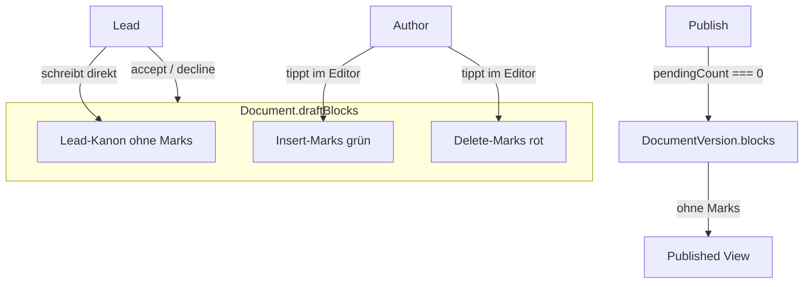

# ADR 004: Inline Draft Suggestions (Track Changes)

## Status

**Akzeptiert** (Produktentscheidung) – ersetzt [ADR 003](003-scope-author-direct-draft.md) für Organisations-Dokumente.

## Kontext

- **ADR 001** (Sidebar-Suggestions mit Block-Ops) war zu schwerfällig in der UI.
- **ADR 003** (Scope Authors überschreiben den Lead-Draft direkt + `DocumentDraftChange`-Ops-Log) gibt dem Lead zu wenig Kontrolle pro Änderung.
- Gewünschtes Modell: Autoren **schreiben visuell im Draft**, Änderungen erscheinen **inline** (Track Changes); der Lead **accept/decline** pro Vorschlag; Publish erst ohne offene Vorschläge.

Siehe auch: [Rechtesystem](../datenmodell/Rechtesystem.md), [Versionierung](../versionierung/Versionierung%20als%20Snapshots%20+%20Deltas.md), [ADR 002](002-block-schema-v1-inline-marks.md) (Inline-Marks).

---

## 1. Zielbild



| Rolle        | Draft lesen | Im Draft arbeiten                     | Accept/Decline | Publish                            |
| ------------ | ----------- | ------------------------------------- | -------------- | ---------------------------------- |
| Scope Author | ja          | ja — nur als Inline-Vorschlag (Marks) | nein           | nein                               |
| Scope Lead   | ja          | ja — direkt in den Kanon (ohne Marks) | ja             | ja (nur wenn `pendingCount === 0`) |
| Leser        | nein        | nein                                  | nein           | nein                               |

**Kein Draft-Versions-Log:** Keine `DocumentDraftChange`-Historie pro Save (ADR 003 entfällt). `draftRevision` bleibt nur für **Optimistic Locking** bei PATCH — nicht als Audit-Trail.

---

## 2. Speicher: alles in `draftBlocks`

**Eine JSON-Quelle:** `Document.draftBlocks` enthält Lead-Kanon **und** pending Inline-Vorschläge. Keine separate Suggestion-Tabelle.

### 2.1 Text-Leaf-Erweiterung (Block-Schema)

Aufbauend auf ADR 002 (`meta.marks` für bold/italic/code) — optionales Feld auf **Text-Leaf-Knoten**:

```typescript
meta: {
  text: string;
  marks?: ('bold' | 'italic' | 'code')[];
  suggestion?: {
    id: string;           // cuid, stabil
    kind: 'insert' | 'delete';
    authorId: string;
    status: 'pending' | 'accepted' | 'rejected' | 'withdrawn';
    createdAt: string;    // ISO-8601
  };
}
```

- **Insert (`kind: insert`, `status: pending`):** Text existiert nur als Vorschlag (UI: grün). Accept → `suggestion` entfernen, Text bleibt im Kanon.
- **Delete (`kind: delete`, `status: pending`):** Original-Text bleibt im JSON; UI: rot, durchgestrichen. Accept → Text-Knoten entfernen; Decline → `suggestion` entfernen, Text normal.

Text-Knoten werden an Suggestion-Grenzen **gesplittet** (analog Bold/Italic-Roundtrip in `blockDocumentTiptap.ts`).

### 2.2 Tiptap / Frontend

- Custom Marks: `suggestionInsert` (grün), `suggestionDelete` (rot, durchgestrichen).
- Widget/Decoration für **Autoren-Kürzel** (Hover: Name, Zeit; Lead: Accept/Decline; Autor: Withdraw/Edit).
- **Lead-Modus:** Schreiben ohne Suggestion-Marks → direkt Kanon.
- **Autor-Modus:** Eingabe/Löschung erzeugt automatisch Suggestion-Marks; kein Überschreiben unmarkierten Kanons.

Phase 1: Absätze und Überschriften (`paragraph`, `heading`). Listen/Block-Level-Suggestions optional später.

---

## 3. Overlap-Regeln

| Situation                               | Regel                                                                                                                                                                                   |
| --------------------------------------- | --------------------------------------------------------------------------------------------------------------------------------------------------------------------------------------- |
| Zwei Autoren fügen Text hinzu           | **Erlaubt** — Vorschläge erscheinen **untereinander** (sequenzielle Inserts am selben Anker: neue Absätze oder benachbarte insert-marked spans; kein Auto-Merge)                        |
| Zwei Autoren löschen dieselbe Stelle    | **Verboten** — Server lehnt überlappende pending `delete`-Spans im selben Block ab (**409**, Code `SUGGESTION_DELETE_OVERLAP`)                                                          |
| Lead editiert Kanon unter pending Marks | Lead-Edits betreffen nur **unmarkierte** Segmente. Bei Konflikt gewinnt der Lead-Edit; betroffene pending Deletes am betroffenen Span werden **withdrawn** (Autor kann neu vorschlagen) |

---

## 4. Publish

- **Gate:** `pendingSuggestionCount === 0` — sonst **400** (kein Publish mit offenen Vorschlägen).
- **Materialisierung:** Beim Publish nur **aufgelösten Kanon** in `DocumentVersion.blocks`: alle `meta.suggestion` entfernen; delete-markierte Segmente weglassen; insert-markierte Segmente als normaler Text ohne Mark.
- **Published / Leser:** `DocumentVersion.blocks` und Published-Preview **niemals** Suggestion-Metadaten.

---

## 5. API (Implementierung folgt)

| Endpoint                               | Zweck                                                                                                                 |
| -------------------------------------- | --------------------------------------------------------------------------------------------------------------------- |
| `GET …/lead-draft`                     | `blocks`, `draftRevision`, `canEdit`, `pendingSuggestionCount`                                                        |
| `PATCH …/lead-draft`                   | Lead: voller Kanon-Edit; Author: nur wenn Body ausschließlich suggestion-marked Änderungen enthält (Server validiert) |
| `POST …/draft/suggestions/:id/accept`  | Lead                                                                                                                  |
| `POST …/draft/suggestions/:id/decline` | Lead                                                                                                                  |
| `PATCH …/draft/suggestions/:id`        | Autor: eigenes pending editieren                                                                                      |
| `DELETE …/draft/suggestions/:id`       | Autor: withdraw                                                                                                       |

**Permissions:** `canEditLeadDraft`, `canPublishDocument`, neu `canResolveDraftSuggestion` (Lead). Autor darf nur eigene pending Suggestions bearbeiten/withdraw.

**Reviews-Inbox:** `GET /me/reviews` — informativ, Dokumente mit `pendingSuggestionCount > 0` im Lead-Scope; kein Accept/Reject in der Inbox (Auflösung im Draft-Editor).

**Presence (aus ADR 003, unverändert):** `POST/GET …/draft/presence`, SSE `document.draft-presence`.

---

## 6. Was ADR 003 obsolet macht

ADR 003 wird **historisch**. Bei Implementierung von ADR 004 vollständig entfernen/ersetzen:

| Bereich               | Entfernen / ersetzen                                                          |
| --------------------- | ----------------------------------------------------------------------------- |
| Prisma                | `DocumentDraftCycle`, `DocumentDraftChange` (+ Migration `DROP TABLE`)        |
| Publish               | Cycle/Change-Cleanup → Publish-Gate `pendingSuggestionCount === 0`            |
| `leadDraftService`    | Author-Change-Log, `computeDraftOpsFromDocuments` für Reviews                 |
| `documentDraftOps.ts` | `computeDraftOpsFromDocuments` (sofern nur ADR 003)                           |
| `meReviewsService`    | Aggregation über `DocumentDraftChange` → `pendingSuggestionCount`             |
| API-Shape             | `myChanges`, `changeCount`, `ReviewDraftChangeDocumentItem` → Inline-Metriken |
| Author-PATCH          | Voller Draft-Overwrite ohne Marks (ADR 003)                                   |

**Behalten aus ADR 003:** Presence, Reviews als Lead-Signal, Scope-Author-Zugriff auf Draft (jetzt via Inline-Suggestions).

---

## 7. Legacy-Entfernung (verbindlich)

**Kein Legacy, kein Deprecated:** ADR 003 und ältere Suggestion-Ansätze werden **nicht** parallel betrieben. Keine Feature-Flags, keine auskommentierten Alt-Pfade.

**Prinzip:** Was ADR 004 ersetzt, wird vollständig entfernt (Code, Schema, Tests, API, UI, Doku-Verweise) — nicht nur deaktiviert.

**Reihenfolge:** Neues Inline-Modell zuerst lauffähig; Legacy in einem dedizierten Cleanup-Schritt löschen (kein halbfertiger Zwischenzustand auf `main`).

### 7.1 Checkliste Legacy

**Datenbank / Prisma**

- [ ] `DocumentDraftCycle`, `DocumentDraftChange` — `DROP TABLE`
- [ ] Publish-Transaction: Cycle/Change-Cleanup entfernen

**Backend**

- [ ] `documentDraftOps.ts` — `computeDraftOpsFromDocuments`, Author-Change-Log (falls nur ADR 003)
- [ ] Author-PATCH ohne Suggestion-Marks in `leadDraftService.ts`
- [ ] `meReviewsService.ts` — DraftChange-Aggregation ersetzen
- [ ] Tests: `documentDraftOps.test.ts`, me.reviews DraftChange, lead-draft Change-Row

**Frontend**

- [ ] Author „Save whole draft“ ohne Marks in `useDocumentLeadDraftPanelState.ts`
- [ ] Reviews-UI: `affectedBlockSummary`, `revisionFrom/To` → pending inline count
- [ ] `useMeReviews.ts` / `ReviewsPage.tsx` — alte Types entfernen

**Qualitätssicherung**

- [ ] Keine Referenzen auf `DocumentDraftChange`, `DocumentDraftCycle`, `computeDraftOpsFromDocuments`, `ReviewDraftChange*`
- [ ] Tests: Publish mit `pendingCount > 0` → 400; overlapping delete → 409; Published ohne `meta.suggestion`

---

## 8. Konsequenzen

| Bereich       | Konsequenz                                                                                             |
| ------------- | ------------------------------------------------------------------------------------------------------ |
| Backend       | Block-Schema Zod erweitern; Accept/Decline materialisiert Spans in `draftBlocks`; Publish strip + gate |
| Frontend      | Tiptap Marks + Autor/Lead-Modi; Kürzel-UI; Reviews auf pending count                                   |
| PDF-Export    | Nur materialisierter Kanon (ohne pending Marks) — wie Published                                        |
| Migration     | Dev: DROP ADR-003-Tabellen; bestehende Drafts ohne Marks bleiben gültig                                |
| ADR 001 / 003 | Historisch; technische Block-IDs und `draftRevision` bleiben relevant                                  |

---

## 9. Implementierungs-Epics (Referenz)

1. Block-Schema / suggestion meta + Zod + Roundtrip
2. Tiptap Marks + Autor/Lead-Editor-Modi
3. Accept/Decline/Withdraw API + overlap validation
4. Publish gate + strip marks
5. ADR-003-Rückbau — **clean removal**
6. Reviews-Inbox + UI (Kürzel, Hover, Lead-Aktionen)
7. Legacy-Audit — grep/Tests

Details: [Umsetzungs-Todo](../../plan/Umsetzungs-Todo.md), später [Edit-System-Blocks-PR-Epics.md](../../plan/Edit-System-Blocks-PR-Epics.md).

---

## 10. ADR 001 / 003

- **ADR 001:** Historisch (Sidebar-Suggestions).
- **ADR 003:** Historisch (Direct Author PATCH + Draft-Change-Ops); ersetzt durch dieses ADR.

---

## Changelog

| Datum   | Änderung                                            |
| ------- | --------------------------------------------------- |
| 2026-06 | Erstfassung — Inline Track Changes, ersetzt ADR 003 |
